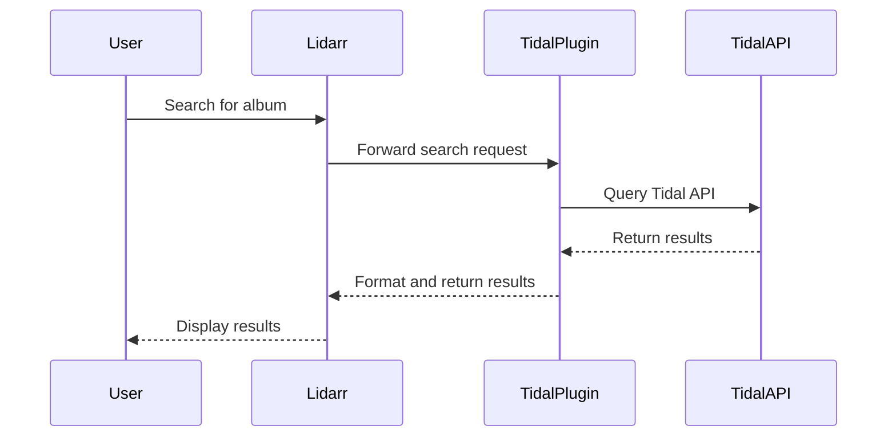

# Documentation Standards for Lidarr Tidal Plugin

This guide defines the standards for documentation in the Lidarr Tidal Plugin project to ensure consistency, accuracy, and usefulness across all documentation.

## XML Documentation Standards

### Classes

```csharp
/// <summary>
/// Provides functionality for [brief description of the class's purpose].
/// </summary>
/// <remarks>
/// [Additional information about using the class, implementation details, etc.]
/// </remarks>
public class ExampleClass
{
    // Class implementation
}
```

### Methods

```csharp
/// <summary>
/// [Brief description of what the method does, starting with a verb].
/// </summary>
/// <param name="paramName">[Description of the parameter].</param>
/// <returns>[Description of the return value].</returns>
/// <exception cref="ExceptionType">[Conditions under which exception is thrown].</exception>
/// <remarks>[Optional additional information].</remarks>
/// <example>
/// <code>
/// var result = ExampleMethod("sample");
/// </code>
/// </example>
public ReturnType ExampleMethod(string paramName)
{
    // Method implementation
}
```

### Properties

```csharp
/// <summary>
/// Gets or sets [description of what the property represents].
/// </summary>
/// <value>[Description of the property's value].</value>
public Type PropertyName { get; set; }
```

### Events

```csharp
/// <summary>
/// Occurs when [description of when the event is raised].
/// </summary>
public event EventHandler<EventArgsType> EventName;
```

### Interfaces

```csharp
/// <summary>
/// Defines functionality for [brief description of the interface's purpose].
/// </summary>
public interface IExampleInterface
{
    // Interface members
}
```

## Markdown Documentation Standards

### File Structure

1. **File Naming**: Use `UPPERCASE_WITH_UNDERSCORES.md` for general documentation files.
2. **File Headers**: Start each file with a top-level heading and short description.

### Headings

- **Level 1 (#)**: File title
- **Level 2 (##)**: Major sections
- **Level 3 (###)**: Subsections
- **Level 4 (####)**: Minor topics

### Content Guidelines

1. **Introductions**: Each document should start with a brief introduction explaining its purpose.
2. **Examples**: Include code examples for complex concepts.
3. **Cross-References**: Use relative links to reference other documentation.
4. **Images/Diagrams**: Include diagrams for complex workflows or architectures.
5. **Code Blocks**: Always specify the language for syntax highlighting.

### Architecture Documentation

Architecture documents should include:

1. **System Overview**: High-level description of the component
2. **Component Diagram**: Visual representation of the architecture
3. **Data Flow**: Description of how data moves through the system
4. **Integration Points**: How the component interacts with other parts of the system
5. **Design Decisions**: Explanation of key architectural decisions

### API Documentation

API documentation should include:

1. **Endpoint Description**: What the API does
2. **Request Parameters**: All parameters with types and descriptions
3. **Response Format**: The structure of the response
4. **Error Codes**: Possible error responses
5. **Example Requests/Responses**: Working examples

### User Guides

User guides should include:

1. **Prerequisites**: Required setup
2. **Step-by-Step Instructions**: Numbered steps for common tasks
3. **Screenshots**: Visual aids for UI interactions
4. **Troubleshooting**: Common issues and their solutions
5. **Configuration Options**: Available customization options

## Images and Diagrams

1. **Format**: Use PNG for screenshots and SVG for diagrams.
2. **Size**: Optimize images for web viewing (< 1MB).
3. **Alt Text**: Include descriptive alt text for all images.
4. **Diagrams**: Create diagrams using Mermaid or PlantUML for easy versioning.

### Mermaid Diagram Example



## Versioning Documentation

1. **Version Tag**: Include version information at the top of each document.
2. **Change Log**: Maintain a record of documentation changes.
3. **Deprecated Features**: Clearly mark deprecated features.

## Review Process

1. **Author Review**: Self-review against these standards
2. **Peer Review**: Review by another team member
3. **Technical Accuracy**: Verification by subject matter expert
4. **Readability Check**: Verification of clarity for target audience

## Documentation Types

### 1. API Reference
- Generated from XML comments
- Organized by namespace

### 2. Conceptual Documentation
- Architecture overviews
- Design principles
- Integration guides

### 3. How-To Guides
- Task-oriented guides
- Step-by-step instructions

### 4. Tutorials
- Learning-oriented guides
- Complete workflows

### 5. Explanations
- Background information
- Design decisions
- Concepts

## Directory Structure

Maintain the following directory structure for documentation:

```
docs/
├── api/                  # API reference (auto-generated)
├── articles/             # Conceptual articles
├── guides/               # How-to guides
├── architecture/         # Architecture documentation
├── images/               # Images and diagrams
├── schema/               # JSON schema documentation
└── README.md             # Documentation index
```

## Documentation Maintenance

1. Update documentation with each code change
2. Review all documentation quarterly
3. Validate links monthly
4. Test code examples with each major release 